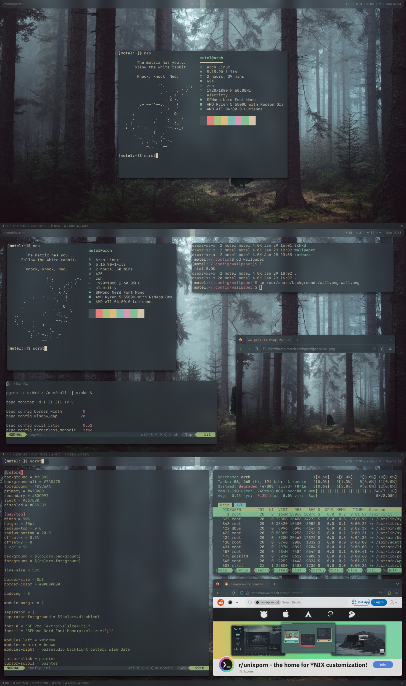

# BSPWM DOTFILES

## Requirements:
- alacritty
- bspwm
- sxhkd
- htop
- neofetch
- neovim
- picom
- polybar
- rofi
- nitrogen
- zathura
- SF Pro Fonts
- SFMono Nerd Fonts

## Preview

## To install:
1. install requirements above
2. create `.config` file on your home/*yourUSER* folder
3. clone this repository in `.config`
4. edit your `.xinitrc`
5. and `startx`
